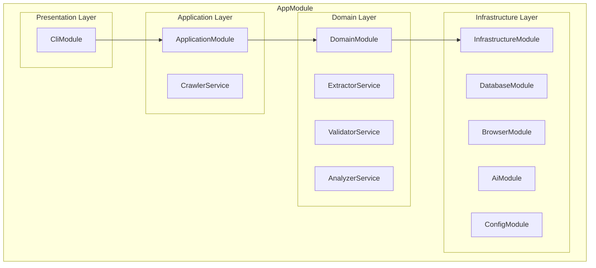
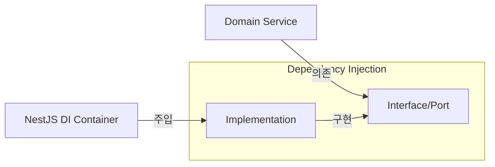
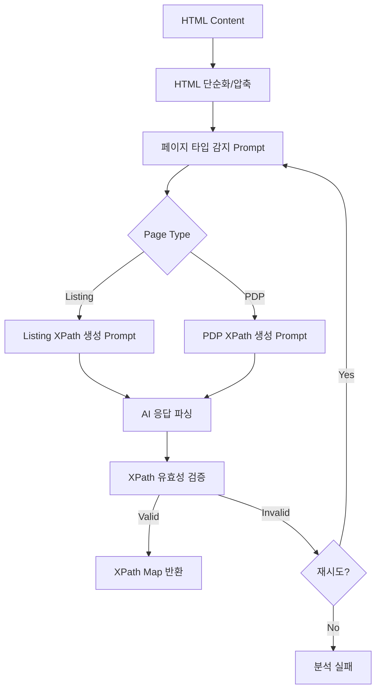
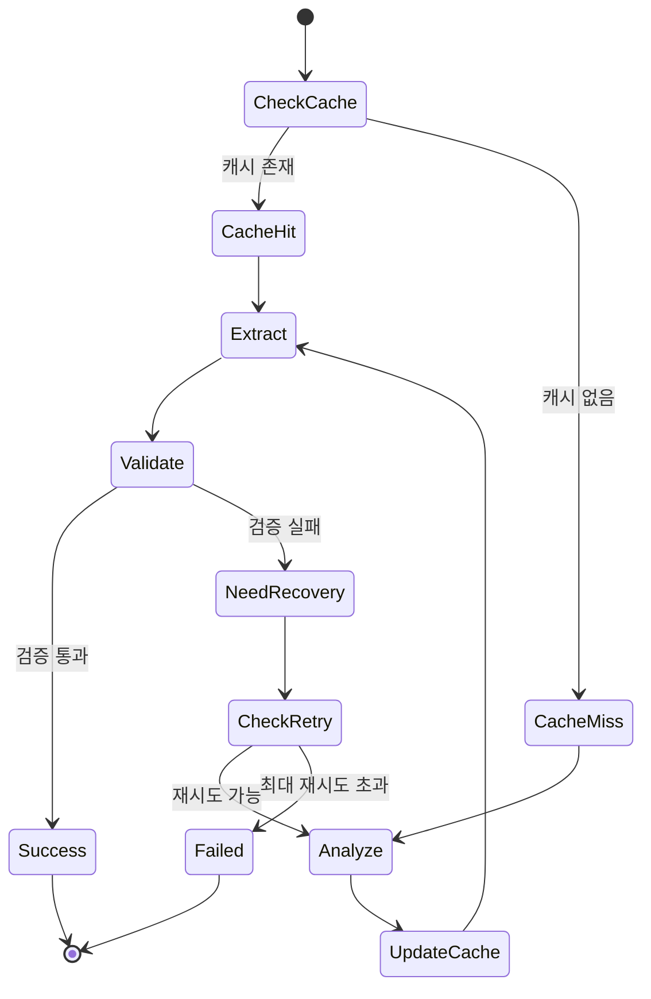
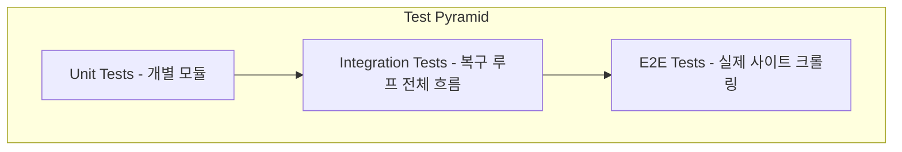

# AI 기반 크롤링 프레임워크 구현 계획

## 기술 스택 결정

| 항목 | 선택 | 이유 |
|------|------|------|
| 런타임 | Node.js + TypeScript | 요구사항 필수 |
| **프레임워크** | **NestJS** | 레이어드 아키텍처, DI 기본 제공, 테스트 용이 |
| 크롤링 | Playwright | 안정성, TS 지원, 멀티 브라우저 |
| AI | Google Gemini API | 요구사항 명시 |
| 저장소 | SQLite (TypeORM) | 서버 불필요, 이식성, NestJS 통합 |
| **테스트** | **Jest** | NestJS 기본 테스트 프레임워크 |

---

## 프로젝트 구조 (NestJS + Layered Architecture)

```
commerce-crawler/
├── src/
│   ├── main.ts                           # NestJS 부트스트랩 (CLI 모드)
│   ├── app.module.ts                     # 루트 모듈
│   │
│   ├── presentation/                     # Presentation Layer (CLI)
│   │   └── cli/
│   │       ├── cli.module.ts
│   │       ├── cli.service.ts            # CLI 명령어 실행
│   │       └── commands/
│   │           ├── crawl.command.ts      # crawl 명령어
│   │           ├── list.command.ts       # list 명령어
│   │           └── cache.command.ts      # cache 명령어
│   │
│   ├── application/                      # Application Layer (Use Cases)
│   │   ├── application.module.ts
│   │   ├── services/
│   │   │   └── crawler.service.ts        # 크롤링 유스케이스 오케스트레이션
│   │   └── dto/
│   │       ├── crawl-request.dto.ts
│   │       └── crawl-result.dto.ts
│   │
│   ├── domain/                           # Domain Layer (Business Logic)
│   │   ├── domain.module.ts
│   │   ├── entities/
│   │   │   ├── xpath-cache.entity.ts     # XPath 캐시 엔티티
│   │   │   ├── product.entity.ts         # 상품 데이터 엔티티
│   │   │   └── page-type.enum.ts         # 페이지 타입 enum
│   │   ├── services/
│   │   │   ├── extractor.service.ts      # 데이터 추출 비즈니스 로직
│   │   │   ├── validator.service.ts      # 데이터 검증 비즈니스 로직
│   │   │   └── analyzer.service.ts       # AI 분석 비즈니스 로직
│   │   └── interfaces/                   # 포트 (추상화)
│   │       ├── xpath-repository.interface.ts
│   │       ├── browser-client.interface.ts
│   │       └── ai-client.interface.ts
│   │
│   ├── infrastructure/                   # Infrastructure Layer (외부 연동)
│   │   ├── infrastructure.module.ts
│   │   ├── database/
│   │   │   ├── database.module.ts        # TypeORM 설정
│   │   │   ├── entities/
│   │   │   │   └── xpath-cache.orm-entity.ts
│   │   │   └── repositories/
│   │   │       └── xpath-cache.repository.ts
│   │   ├── browser/
│   │   │   ├── browser.module.ts
│   │   │   └── playwright.client.ts      # Playwright 구현체
│   │   ├── ai/
│   │   │   ├── ai.module.ts
│   │   │   ├── gemini.client.ts          # Gemini API 구현체
│   │   │   └── prompts/
│   │   │       ├── page-type.prompt.ts
│   │   │       └── xpath-generation.prompt.ts
│   │   └── config/
│   │       ├── config.module.ts
│   │       └── configuration.ts
│   │
│   └── common/                           # Common (공통 유틸)
│       ├── constants/
│       │   └── injection-tokens.ts       # DI 토큰
│       ├── exceptions/
│       │   ├── crawl.exception.ts
│       │   └── validation.exception.ts
│       ├── filters/
│       │   └── all-exceptions.filter.ts
│       └── utils/
│           └── logger.ts
│
├── test/
│   ├── unit/
│   │   ├── domain/
│   │   │   ├── extractor.service.spec.ts
│   │   │   ├── validator.service.spec.ts
│   │   │   └── analyzer.service.spec.ts
│   │   └── infrastructure/
│   │       ├── xpath-cache.repository.spec.ts
│   │       ├── playwright.client.spec.ts
│   │       └── gemini.client.spec.ts
│   ├── integration/
│   │   └── crawler.service.spec.ts
│   ├── e2e/
│   │   └── crawl.e2e-spec.ts
│   ├── fixtures/
│   │   ├── coupang-listing.html
│   │   ├── coupang-pdp.html
│   │   ├── naver-listing.html
│   │   └── naver-pdp.html
│   └── mocks/
│       ├── gemini.mock.ts
│       └── browser.mock.ts
│
├── package.json
├── tsconfig.json
├── tsconfig.build.json
├── nest-cli.json
├── .env.example
└── README.md
```

---

## NestJS 모듈 구조



### 의존성 주입 흐름



| 인터페이스 | 구현체 | 설명 |
|-----------|--------|------|
| `IXPathRepository` | `XPathCacheRepository` | XPath 캐시 저장소 |
| `IBrowserClient` | `PlaywrightClient` | 브라우저 제어 |
| `IAiClient` | `GeminiClient` | AI API 호출 |

---

## 핵심 코어 로직 상세 설계

> 이 프로젝트의 성패를 결정하는 4가지 핵심 로직

### 핵심 1: AI 분석 로직 (AnalyzerService) ⭐⭐⭐⭐⭐

**프로젝트의 심장** - AI가 HTML을 분석하여 XPath를 생성하는 핵심 로직

#### 1.1 전체 흐름



#### 1.2 HTML 전처리 전략

AI 토큰 제한과 비용 최적화를 위한 HTML 압축:

```typescript
interface HtmlSimplifyOptions {
  removeScripts: boolean;      // <script> 제거
  removeStyles: boolean;       // <style> 제거
  removeComments: boolean;     // 주석 제거
  removeHiddenElements: boolean; // display:none 제거
  maxDepth: number;            // DOM 깊이 제한
  maxLength: number;           // 최대 문자 수
  preserveAttributes: string[]; // 유지할 속성 (class, id, data-*)
}

// 압축 전: ~500KB
// 압축 후: ~30KB (토큰 절약)
```

#### 1.3 프롬프트 설계 (핵심 중의 핵심)

**A. 페이지 타입 감지 프롬프트**

```
[System]
당신은 전자상거래 웹사이트 HTML 구조 분석 전문가입니다.

[Task]
주어진 HTML을 분석하여 페이지 유형을 판별하세요.

[Page Types]
1. LISTING: 여러 상품이 그리드/리스트로 나열된 페이지
   - 특징: 반복되는 상품 카드 구조, 썸네일 이미지 다수, 페이지네이션
   
2. PDP (Product Detail Page): 단일 상품 상세 페이지
   - 특징: 큰 상품 이미지, 상세 설명, 옵션 선택, 구매 버튼

[Output Format]
JSON만 출력하세요:
{
  "pageType": "LISTING" | "PDP",
  "confidence": 0.0-1.0,
  "reasoning": "판단 근거 한 줄"
}

[HTML]
{simplified_html}
```

**B. Listing 페이지 XPath 생성 프롬프트**

```
[System]
당신은 XPath 전문가입니다. 전자상거래 목록 페이지에서 상품 정보를 추출하는 XPath를 생성합니다.

[Task]
HTML에서 각 상품의 정보를 추출할 수 있는 XPath를 생성하세요.

[Required Fields]
1. productCard: 개별 상품 카드를 감싸는 컨테이너 (반복 단위)
2. thumbnail: 상품 썸네일 이미지 URL (src 또는 data-src)
3. name: 상품명 텍스트
4. price: 가격 텍스트
5. url: 상품 상세 페이지 링크 (href)

[XPath Guidelines]
- 가능한 구체적인 XPath 사용 (id, class 활용)
- 동적 클래스명(hash 포함)은 contains() 사용
- 상대 경로 사용 (.//로 시작)
- productCard 기준 상대 XPath로 나머지 필드 작성

[Output Format]
JSON만 출력:
{
  "productCard": "//div[contains(@class, 'product-item')]",
  "thumbnail": ".//img/@src",
  "name": ".//a[contains(@class, 'name')]/text()",
  "price": ".//span[contains(@class, 'price')]/text()",
  "url": ".//a/@href"
}

[HTML]
{simplified_html}
```

**C. PDP 페이지 XPath 생성 프롬프트**

```
[System]
당신은 XPath 전문가입니다. 전자상거래 상품 상세 페이지에서 정보를 추출하는 XPath를 생성합니다.

[Task]
HTML에서 상품 상세 정보를 추출할 수 있는 XPath를 생성하세요.

[Required Fields]
1. brandName: 브랜드명 (없으면 null 허용)
2. productName: 상품명 (필수)
3. price: 가격 (필수)
4. description: 상품 설명
5. options: 옵션 목록 (색상, 사이즈 등)
6. detailImages: 상세 이미지 URL 목록

[XPath Guidelines]
- 절대 경로 또는 id 기반 XPath 선호
- 텍스트 추출: /text() 또는 string()
- 다중 요소: 복수형 XPath
- 속성 추출: /@src, /@href 등

[Output Format]
JSON만 출력:
{
  "brandName": "//span[@class='brand']/text()" | null,
  "productName": "//h1[@class='product-title']/text()",
  "price": "//span[@class='price']/text()",
  "description": "//div[@class='description']",
  "options": "//select[@class='option']/option/text()",
  "detailImages": "//div[@class='detail-images']//img/@src"
}

[HTML]
{simplified_html}
```

#### 1.4 AI 응답 파싱 및 검증

```typescript
interface AnalyzerResult {
  pageType: PageType;
  xpaths: XPathMap;
  confidence: number;
  rawResponse: string;
}

// AI 응답에서 JSON 추출
function parseAiResponse(response: string): object {
  // 1. 코드 블록 내 JSON 추출
  const jsonMatch = response.match(/```json?\s*([\s\S]*?)\s*```/);
  if (jsonMatch) return JSON.parse(jsonMatch[1]);
  
  // 2. 순수 JSON 파싱 시도
  return JSON.parse(response);
}

// XPath 유효성 검증
function validateXPath(xpath: string): boolean {
  try {
    document.evaluate(xpath, document, null, XPathResult.ANY_TYPE, null);
    return true;
  } catch {
    return false;
  }
}
```

#### 1.5 에러 핸들링 전략

| 에러 유형 | 처리 방식 |
|----------|----------|
| AI API 타임아웃 | 3회 재시도 후 실패 |
| JSON 파싱 실패 | 프롬프트 수정 후 재시도 |
| 유효하지 않은 XPath | AI에게 피드백 후 재생성 요청 |
| 페이지 타입 불명확 | confidence < 0.7이면 재분석 |

---

### 핵심 2: 스마트 복구 루프 (CrawlerService) ⭐⭐⭐⭐

**프로젝트의 두뇌** - 전체 크롤링 흐름을 제어하고 자가 복구를 수행

#### 2.1 상태 머신 설계



#### 2.2 복구 루프 알고리즘

```typescript
interface CrawlContext {
  url: string;
  domain: string;
  retryCount: number;
  maxRetries: number;
  lastError?: Error;
  xpathCache?: XPathMap;
}

async function crawlWithRecovery(url: string): Promise<CrawlResult> {
  const context: CrawlContext = {
    url,
    domain: extractDomain(url),
    retryCount: 0,
    maxRetries: 3,
  };

  while (context.retryCount <= context.maxRetries) {
    try {
      // Step 1: 캐시 확인
      const cachedXPaths = await xpathRepository.findByDomain(context.domain);
      
      // Step 2: HTML 가져오기
      const html = await browserClient.getPageContent(url);
      
      // Step 3: XPath 결정 (캐시 or AI 분석)
      let xpaths: XPathMap;
      if (cachedXPaths && context.retryCount === 0) {
        xpaths = cachedXPaths;
        logger.info('Using cached XPaths');
      } else {
        logger.info('Analyzing page with AI...');
        const analysis = await analyzerService.analyze(html);
        xpaths = analysis.xpaths;
        await xpathRepository.upsert(context.domain, analysis.pageType, xpaths);
      }
      
      // Step 4: 데이터 추출
      const extractedData = await extractorService.extract(html, xpaths);
      
      // Step 5: 검증
      const validation = validatorService.validate(extractedData);
      
      if (validation.isValid) {
        return { success: true, data: extractedData };
      }
      
      // Step 6: 검증 실패 → 복구 시도
      logger.warn(`Validation failed: ${validation.errors.join(', ')}`);
      context.retryCount++;
      context.lastError = new ValidationError(validation.errors);
      
      // 캐시 무효화 (다음 루프에서 AI 재분석)
      await xpathRepository.invalidate(context.domain);
      
    } catch (error) {
      context.retryCount++;
      context.lastError = error;
      logger.error(`Crawl attempt ${context.retryCount} failed:`, error);
    }
  }

  // 최대 재시도 초과
  return { 
    success: false, 
    error: `Max retries exceeded. Last error: ${context.lastError?.message}` 
  };
}
```

#### 2.3 재시도 전략

| 재시도 횟수 | 동작 | 대기 시간 |
|------------|------|----------|
| 1회차 | 캐시된 XPath 사용 | - |
| 2회차 | AI 재분석 (기본 프롬프트) | 1초 |
| 3회차 | AI 재분석 (상세 프롬프트 + 이전 에러 피드백) | 2초 |
| 4회차 | 실패 처리 | - |

---

### 핵심 3: 데이터 검증 로직 (ValidatorService) ⭐⭐⭐

**복구 트리거** - 언제 AI 재분석을 할지 결정

#### 3.1 검증 규칙 정의

```typescript
interface ValidationRule {
  field: string;
  required: boolean;
  type: 'string' | 'number' | 'url' | 'array';
  pattern?: RegExp;
  minLength?: number;
  minItems?: number;  // 배열용
}

// Listing 검증 규칙
const listingRules: ValidationRule[] = [
  { field: 'products', required: true, type: 'array', minItems: 1 },
  { field: 'products[].name', required: true, type: 'string', minLength: 1 },
  { field: 'products[].price', required: true, type: 'string', pattern: /[\d,]+/ },
  { field: 'products[].url', required: true, type: 'url' },
  { field: 'products[].thumbnail', required: false, type: 'url' },
];

// PDP 검증 규칙
const pdpRules: ValidationRule[] = [
  { field: 'productName', required: true, type: 'string', minLength: 1 },
  { field: 'price', required: true, type: 'string', pattern: /[\d,]+/ },
  { field: 'brandName', required: false, type: 'string' },
  { field: 'description', required: false, type: 'string' },
  { field: 'options', required: false, type: 'array' },
  { field: 'detailImages', required: false, type: 'array' },
];
```

#### 3.2 검증 로직 구현

```typescript
interface ValidationResult {
  isValid: boolean;
  errors: ValidationError[];
  warnings: string[];
  score: number;  // 0-100 품질 점수
}

function validate(data: ExtractedData, pageType: PageType): ValidationResult {
  const rules = pageType === 'LISTING' ? listingRules : pdpRules;
  const errors: ValidationError[] = [];
  const warnings: string[] = [];
  
  for (const rule of rules) {
    const value = getNestedValue(data, rule.field);
    
    // 필수 필드 체크
    if (rule.required && isEmpty(value)) {
      errors.push({ field: rule.field, message: 'Required field is empty' });
      continue;
    }
    
    // 타입 체크
    if (!isEmpty(value) && !checkType(value, rule.type)) {
      errors.push({ field: rule.field, message: `Expected ${rule.type}` });
    }
    
    // 패턴 체크
    if (rule.pattern && !rule.pattern.test(String(value))) {
      errors.push({ field: rule.field, message: 'Pattern mismatch' });
    }
    
    // 최소 길이/개수 체크
    if (rule.minLength && String(value).length < rule.minLength) {
      warnings.push(`${rule.field} is shorter than expected`);
    }
    
    if (rule.minItems && Array.isArray(value) && value.length < rule.minItems) {
      errors.push({ field: rule.field, message: `Expected at least ${rule.minItems} items` });
    }
  }
  
  // 품질 점수 계산
  const totalFields = rules.length;
  const validFields = totalFields - errors.length;
  const score = Math.round((validFields / totalFields) * 100);
  
  return {
    isValid: errors.length === 0,
    errors,
    warnings,
    score,
  };
}
```

#### 3.3 검증 실패 시 피드백 생성

AI 재분석 시 이전 실패 정보를 전달:

```typescript
function generateRecoveryFeedback(validation: ValidationResult): string {
  const feedback = [
    '이전 XPath 분석이 실패했습니다. 다음 문제를 수정해주세요:',
    '',
    ...validation.errors.map(e => `- ${e.field}: ${e.message}`),
    '',
    '새로운 XPath를 생성할 때 위 필드들에 특히 주의해주세요.',
  ];
  
  return feedback.join('\n');
}
```

---

### 핵심 4: XPath 추출 로직 (ExtractorService) ⭐⭐

**실행 엔진** - XPath를 적용하여 실제 데이터 추출

#### 4.1 추출 전략

```typescript
interface ExtractionStrategy {
  // 단일 값 추출
  extractSingle(html: string, xpath: string): string | null;
  
  // 다중 값 추출 (배열)
  extractMultiple(html: string, xpath: string): string[];
  
  // 속성 추출
  extractAttribute(html: string, xpath: string, attr: string): string | null;
  
  // 중첩 추출 (상품 카드 내 필드들)
  extractNested(html: string, containerXPath: string, fieldXPaths: Record<string, string>): object[];
}
```

#### 4.2 Playwright 기반 추출 구현

```typescript
async function extractWithPlaywright(
  page: Page, 
  xpaths: XPathMap, 
  pageType: PageType
): Promise<ExtractedData> {
  
  if (pageType === 'LISTING') {
    return await page.evaluate((xp) => {
      const products = [];
      const containers = document.evaluate(
        xp.productCard, document, null, 
        XPathResult.ORDERED_NODE_SNAPSHOT_TYPE, null
      );
      
      for (let i = 0; i < containers.snapshotLength; i++) {
        const container = containers.snapshotItem(i);
        products.push({
          name: extractText(container, xp.name),
          price: extractText(container, xp.price),
          url: extractAttr(container, xp.url, 'href'),
          thumbnail: extractAttr(container, xp.thumbnail, 'src'),
        });
      }
      
      return { products };
    }, xpaths);
  }
  
  // PDP 추출 로직...
}
```

---

### 코어 로직 테스트 전략

| 코어 로직 | 테스트 방식 | 우선순위 |
|----------|------------|---------|
| AnalyzerService | Mock AI 응답 + 다양한 HTML fixtures | 최상 |
| CrawlerService | 상태 전이 테스트 + 통합 테스트 | 상 |
| ValidatorService | 경계값 테스트 + 다양한 데이터 케이스 | 상 |
| ExtractorService | 실제 HTML fixtures + XPath 검증 | 중 |

---

### 데이터 스키마

**XPath 캐시 엔티티 (TypeORM):**
```typescript
@Entity('xpath_cache')
export class XPathCacheEntity {
  @PrimaryGeneratedColumn()
  id: number;

  @Column()
  siteDomain: string;

  @Column({ type: 'varchar' })
  pageType: PageType; // 'listing' | 'pdp'

  @Column()
  fieldName: string;

  @Column()
  xpath: string;

  @CreateDateColumn()
  createdAt: Date;

  @UpdateDateColumn()
  updatedAt: Date;
}
```

**추출 데이터 타입:**
```typescript
interface ListingData {
  products: Array<{
    thumbnail: string;
    name: string;
    price: string;
    url: string;
  }>;
}

interface PDPData {
  brandName: string | null;
  productName: string;
  description: string | null;
  options: string[];
  price: string;
  detailImages: string[];
}
```

---

## 테스트 전략

### 테스트 피라미드



| 레벨 | 대상 | 테스트 방식 |
|------|------|------------|
| Unit | Domain Services, Validators | NestJS Testing Module + Mock |
| Unit | Infrastructure (Repository, Clients) | Jest Mock + Fixtures |
| Integration | CrawlerService | TestingModule + SQLite In-Memory |
| E2E | 전체 CLI 흐름 | 실제 사이트 크롤링 (선택적 실행) |

### 테스트 실행 명령어

```bash
# 전체 테스트
npm test

# 단위 테스트만
npm run test:unit

# 통합 테스트만
npm run test:integration

# E2E 테스트 (실제 네트워크 필요)
npm run test:e2e

# 커버리지 리포트
npm run test:cov

# Watch 모드 (개발 중)
npm run test:watch
```

### 각 레이어별 테스트 포인트

| 레이어 | 모듈 | 테스트 케이스 |
|--------|------|--------------|
| **Common** | `Logger` | 로그 레벨 필터링, 포맷팅 |
| **Infrastructure** | `DatabaseModule` | 연결/해제, 마이그레이션 |
| **Infrastructure** | `XPathCacheRepository` | CRUD 작업, upsert, 도메인별 조회 |
| **Infrastructure** | `PlaywrightClient` | 페이지 로드, HTML 추출, 타임아웃 처리 |
| **Infrastructure** | `GeminiClient` | API 호출, 에러 핸들링, 재시도 로직 |
| **Domain** | `AnalyzerService` | 페이지 타입 감지, XPath 생성 로직 |
| **Domain** | `ExtractorService` | XPath 적용, 다중 요소 추출, null 처리 |
| **Domain** | `ValidatorService` | 필수 필드 검증, 패턴 매칭, 에러 리포트 |
| **Application** | `CrawlerService` | 캐시 히트/미스, 복구 루프, 재시도 제한 |

---

## 구현 순서 (테스트 포함, 레이어별)

### Phase 1: 프로젝트 초기화
1. NestJS 프로젝트 생성 + 기본 설정
2. 공통 모듈 (`common/`) - 상수, 예외, 유틸리티

### Phase 2: Domain Layer - 인터페이스 정의
3. 엔티티 정의 (`domain/entities`)
4. 포트/인터페이스 정의 (`domain/interfaces`)

### Phase 3: Infrastructure Layer - 외부 연동
5. ConfigModule 설정 (`infrastructure/config`)
6. DatabaseModule + TypeORM 설정 + 테스트
7. XPathCacheRepository 구현 + 테스트
8. BrowserModule + PlaywrightClient 구현 + 테스트
9. AiModule + GeminiClient 구현 + Mock 테스트

### Phase 4: Domain Layer - 비즈니스 로직
10. ExtractorService 구현 + 테스트
11. ValidatorService 구현 + 테스트
12. AnalyzerService 구현 + 테스트

### Phase 5: Application Layer - 유스케이스
13. DTO 정의 (`application/dto`)
14. CrawlerService 구현 + 통합 테스트

### Phase 6: Presentation Layer - CLI
15. CLI 모듈 구현 (nest-commander 활용)
16. 각 명령어 구현 (crawl, list, cache)

### Phase 7: E2E 검증
17. E2E 테스트 시나리오 작성 및 실행

---

## CLI 사용 예시

```bash
# 단일 URL 크롤링 (PDP)
npx commerce-crawler crawl https://www.coupang.com/vp/products/123456

# 목록 페이지에서 상품 URL 추출
npx commerce-crawler list https://www.coupang.com/np/search?component=&q=%ED%97%A4%EC%96%B4%EB%B0%B4%EB%93%9C
# 캐시 상태 확인
npx commerce-crawler cache --list

# 특정 사이트 캐시 초기화
npx commerce-crawler cache --clear --site coupang.com

# 전체 캐시 초기화
npx commerce-crawler cache --clear-all
```

---

## 주요 고려사항

1. **Rate Limiting**: 요청 간 적절한 딜레이 적용
2. **User-Agent**: 실제 브라우저와 유사한 헤더 설정
3. **에러 핸들링**: NestJS Exception Filter 활용
4. **로깅**: NestJS Logger + 파일 로깅
5. **테스트 격리**: NestJS TestingModule로 독립적 테스트
6. **테스트 데이터**: fixtures 폴더에 실제 사이트 HTML 스냅샷 보관
7. **DI 활용**: 인터페이스 기반 의존성 주입으로 Mock 교체 용이